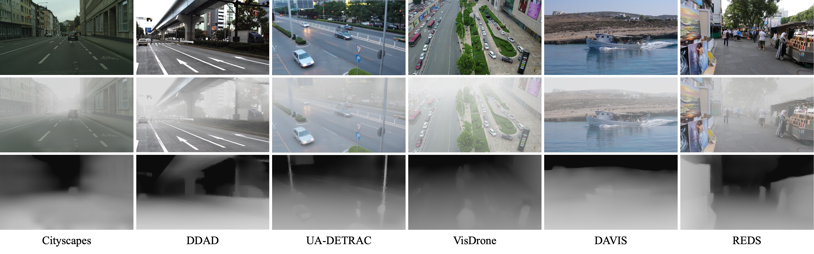

# MAP-Net

PyTorch implementation of the paper **MAP-Net**, from the following paper:

[Video Dehazing via a Multi-Range Temporal Alignment Network with Physical Prior](). CVPR 2023.\
Jiaqi Xu, Xiaowei Hu, Lei Zhu, Qi Dou, Jifeng Dai, Yu Qiao, Pheng-Ann Heng

<p align="center">

</p>

We propose **MAP-Net**, a novel video dehazing framework that effectively explores the physical haze priors and aggregates temporal information.


## Dataset

<p align="center">

</p>

We construct a large-scale outdoor video dehazing benchmark dataset, **HazeWorld**, which contains video frames in various real-world scenarios.


## Installation

This implementation is based on [MMEditing](https://github.com/open-mmlab/mmediting),
which is an open-source image and video editing toolbox.

```
python 3.10.9
pytorch 1.12.1
torchvision 0.13.1
cuda 11.3
```

Below are quick steps for installation.

**Step 1.**
Install PyTorch following [official instructions](https://pytorch.org/get-started/locally/).

**Step 2.**
Install MMCV with [MIM](https://github.com/open-mmlab/mim).

```shell
pip3 install openmim
mim install mmcv-full
```

**Step 3.**
Install MAP-Net from source.

```shell
git clone https://github.com/jiaqixuac/MAP-Net.git
cd mmediting
pip3 install -e .
```

Please refer to [MMEditing Installation](https://github.com/open-mmlab/mmediting/blob/master/docs/en/install.md) for more detailed instruction.

[//]: # (## Getting Started)


## Acknowledgement

This repository is built using the [mmedit (v1.0.0rc6)](https://github.com/open-mmlab/mmediting/tree/1.x)
and [mmseg](https://github.com/open-mmlab/mmsegmentation) toolboxes,
[DAT](https://github.com/LeapLabTHU/DAT)
and [Deformable DETR](https://github.com/fundamentalvision/Deformable-DETR) repositories.


## Citation

If you find this repository helpful to your research, please consider citing the following:

```bibtex
@inproceedings{xu2023video,
  title     = {Video Dehazing via a Multi-Range Temporal Alignment Network with Physical Prior},
  author    = {Jiaqi Xu and Xiaowei Hu and Lei Zhu and Qi Dou and Jifeng Dai and Yu Qiao and Pheng-Ann Heng},
  booktitle = {Proceedings of the IEEE/CVF Conference on Computer Vision and Pattern Recognition (CVPR)},
  year      = {2023},
}
```


## License

This project is released under the [Apache 2.0 license](./LICENSE).
